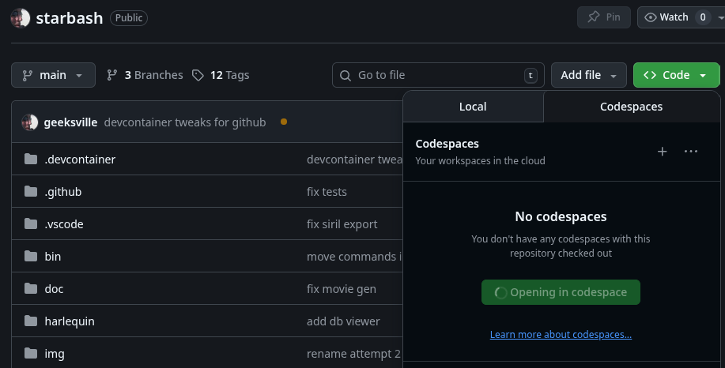

# Starbash developers guide

Starbash is written in 100% python.  It is intended to be extended by other developers/users as needed.  Please send in pull-requests and/or open issues if you are thinking of working on something.

## Getting the code

In your directory of choice, run:
```
git clone https://github.com/geeksville/starbash
```

## Building the code (Option 1: the easy way)

The recommended build/development tool/environment is [vscode](https://code.visualstudio.com/).  If you have vscode you can open our developer environment with:

```
cd your starbash tree
code .
```

You will be prompted "do you want to open this in a devcontainer?"  You should say yes.
If prompted to select a container, just pick the default.

This will create a container (after a few minutes) with all of our various build tools and depedences.  You can choose to run or debug various project options.  Or run your starbash sources from the internal terminal pane (with "sb <someopt>" etc...)

## Building the code (Option 2: the slightly harder way)

The actual build of our python package is done via [poetry](https://python-poetry.org/) - and that tool should be sufficent to build starbash on any modern OS.

If you don't have poetry do:
```
pipx install poetry
```

Then in the starbash directory commands like the following will work:
```
> poetry install --with=dev
# This will install starbash and various build time python tools

> poetry run sb repo list
# you can run starbash commands from within poetry

> sb repo list
# you can also run your development starbash code straight from the command line
```

## Building the code 'in the cloud (Option 3: probably not recommended)

If you just want to see what the build environment for starbash looks like you can run an instance of vscode in the github cloud.  It will take a number of minutes for the first launch (5?) but fast after that.

This is mostly useful if you want a second 'virgin' build machine to compare against.  The button to click in github looks like:



## Field exception reports

Project members can access user crash reports [here](https://geeksville.sentry.io/insights/projects/starbash/?project=4510264204132352).