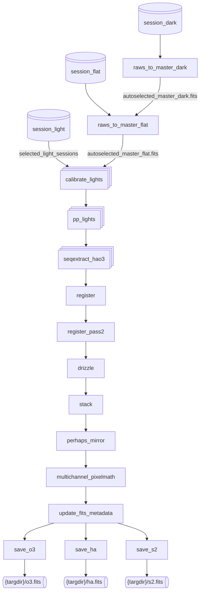

# doit

## Plan
idea for next version:
fixme - instead we should just have a depends="seqextract_HaOIII", which in turn
depends="calibrate_light_from_bias" | "calibrate_light_from_dark".  then starbash can build a dependency graph of stages
to run based on what is needed?
resolve | dependencies by priority - prefer higher pri stage (calibrate_light_from_dark)
if that stage .is_allowed() && .has_inputs()

fundamentally: on the input side we have a list of sessions.
on the output side we have some FITS files our pipeline promises to make
we want to have full dependency tree from those outputs back to the inputs
plus added dependencies on the recipe stages and masters which might be used to make
those outputs.

btw: masters are handled in the same tree of dependencies.  a master depends on
its raw inputs
possibly useful? https://pydoit.org/dependencies.html and
https://pydoit.org/cmd-run.html#using-the-api

the stack would depend on seqextract_HaOIII (which would require appropriate filters to be considered)
so to process a set of sessions:
stages would be selected based on what stages are permitted by auto.require?

any way to link these stages based on the output files also?

## typical graph'
When doing processing we have as inputs:
* a set of **possible** recipes
* a set of **possible** raw darks, flats and biases
* a set of selected light sessions

Based on the targets in the selected light sessions we can build a set of required outputs:
* a set of output targetdirs with a glob showing mininum set of files for success?

A typical (after culling) set of tasks is something like this (dual duo band OSC filter shown):

FIXME: explain culling and how it fits into the workflow.

The single boxes are one once, the stacked boxes (like in 'calibrate_lights') are run once per session.

Tasks are only run if they are needed by a downstream task.  i.e. most times raws_to_master_flat will not need to run at all.  Because the graph will capture the input file to output file dependencies.

