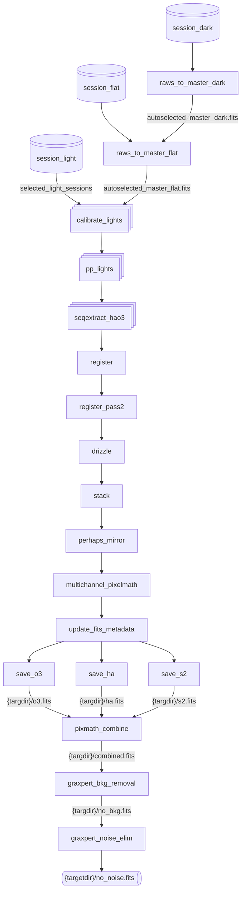

# doit

## Plan
idea for next version:
fixme - instead we should just have a depends="seqextract_HaOIII", which in turn
depends="calibrate_light_from_bias" | "calibrate_light_from_dark".  then starbash can build a dependency graph of stages
to run based on what is needed?
resolve | dependencies by priority - prefer higher pri stage (calibrate_light_from_dark)
if that stage .is_allowed() && .has_inputs()

fundamentally: on the input side we have a list of sessions.
on the output side we have some FITS files our pipeline promises to make
we want to have full dependency tree from those outputs back to the inputs
plus added dependencies on the recipe stages and masters which might be used to make
those outputs.

btw: masters are handled in the same tree of dependencies.  a master depends on
its raw inputs
possibly useful? https://pydoit.org/dependencies.html and
https://pydoit.org/cmd-run.html#using-the-api

the stack would depend on seqextract_HaOIII (which would require appropriate filters to be considered)
so to process a set of sessions:
stages would be selected based on what stages are permitted by auto.require?

any way to link these stages based on the output files also?

## Notes

When doing processing we have as inputs:
* a set of **possible** recipes
* a set of **possible** raw darks, flats and biases
* a set of selected light sessions

Based on the targets in the selected light sessions we can build a set of required outputs:
* a set of output targetdirs with a glob showing mininum set of files for success?

FIXME: explain culling and how it fits into the workflow.

The single boxes are one once, the stacked boxes (like in 'calibrate_lights') are run once per session.

Tasks are only run if they are needed by a downstream task.  i.e. most times raws_to_master_flat will not need to run at all.  Because the graph will capture the input file to output file dependencies.

Each of the tasks are implemented by a single Tool (currently Siril, Graxpert or python).  As an optimization before execution any adjacent Siril tasks will be merged into a **single** Siril invocation.

Initially use the current master-gen code, but plan for possibly using dependencies for that as well.

Eventually support 'watch' by setting the watch entry for source repos. https://pydoit.org/cmd-other.html#auto-watch

## Stages -> tasks

Possibly a 1:1 relationship between recipe stages and doit tasks?  Each stage would be quite a bit smaller than the current implementation.  But a stage would be required to specify outputfiles in the output direction.  It would also be required to specify either input files or input-stages for dependency linking.

Stages could have auto.requires directives to determine if they are candidates.

Stages would have a stage.multiplex? option.  two are are supported "session" (used for light calibration or making dark frames).  This kind of stage will have multiple tasks created - one per session (for the current target).  and "post-session" - which will create one task per target (for things like stacking etc...).  In the future it would be easy to add stages like "pre-session" (once per target before sessions) and even something like "on-app-start"?
Note: stage.multiplex usually doesn't need to be manually set in recipes.  If a particular stage has **any** "session" inputs it will automatically set to "session".  And if not multiplex will be set to "single".

Remove the existing master-stages and stages arrays.  they are not needed.

make a make_tasks(stage: stage, sessions: list[SessionRow]) -> list[tasks] method in processing?

## master generation

could it be as simple as using the regular make_tasks() but passing in all the dark sessions and expecting them to output to {targetdir}/mastername-but-generated-from-session-info?

FIXME test writing a new make masters and a new osc preprocess script...

## Culling

Note: two different tasks can not have the same (typically a file) target.  Therefore before creating the tasks for stuff like stacking etc (which will be outputing to {targetdir}/somefile.fits) we need to know **which** tasks we will be using on this run.  So I think that means we need to do our culling in advance of passing the list of task objects into doit. See https://pydoit.org/tasks.html#targets

Perhaps that means we could build our initial set of task dicts from our complete set of recipes/stages and selected input files.

This would allow us to known {targetdir} etc... very early in the process - so we could load the (possibly customized starbash.toml) file from that directory.

To do culling we'd build a list of targets.  If we ever have multiple stages (probably from different recipes) building the same target path, one of those stages has to be culled.  Generate a list of Candidates sorted by stage.priority.  Default to pick the first one, but for the rest just put them in the toml.  stage.kind would have to match for all those conflicts (i.e. in this case 'gen-stacked'?)  Then we'd store the choices in options.gen_stacked = [ foo ].

Masters could be disambigated the same way, because there would be a stage that has an output of "{procdir}/master-dark.fits".  Presumably there could be multiple master-raw sessions all mapping to the same final master-dark.fits filename.  That conflict would result in the exact same (shared code and everything) resolution for master Candidates and just picking one.

All stages would have a unique well known long_name, for instance com.geeksville.osc_dual_duo_stack.  In fact, we can auto construct this from the recipe url.  The short name would just be osc_dual_duo_stack in this case (assuming the recipe file was osc_dual_duo and the name entry in that file was "stack")

There would be a few standard kind (so that stackers could be compared to stackers etc) [ "gen.master.dark", "gen.calibrate.lights", "gen.stack.final" ]?

How would kind work for things like the possibly 1 to 5 different substages of light pipelnes? FIXME how to let that mixand match?
* consider calibrate_lights stage?  it would input from {session_lights}/*.fits.  It would output to "{procdir}/lights_.seq"
* the pp_lights stage would input from "{procdir}/lights_.seq" and output to "{procdir}pp_lights_.seq".
* seqextract_hao3 inputs from pp_lights.seq and outputs to pp_final.seq.

**pp_final.seq** would be considered the required standard output of the entire "gen.calibrate.lights" 'kind'.  In the duo filter case there is a "seqextract_hao3" stage to generate that.  How do we handle the more common "just OSC" case?

I think we handle it by including (lower priority?) stages called "osc_cal_final" which depends on pp_lights.seq and outputs pp_final.seq (by just creating a symlink?  or somehow otherwise coupling without a file in doit dependencies? FIXME)

If that results in a conflict we could handle it like any other?  I'm not yet suer FIXME

btw: I think this would nicely allow Nina lights sessions to be nicely stackable with Seestar lights.

## doit concepts

Create a custom task loader to create (programmatically) my tree of tasks: https://pydoit.org/extending.html#example-pre-defined-task

A Task dict has:
* name
* help
* actions: list
* (optional) file_dep: list[str]
* (optional) targets: list[str]
Note: if file_dep and targets are equal between two different tasks (as a str cmp), doit will automatically realize there is a dependency there

Possibly the main entrypoint to start dependency processing would be (after creating and culling tasks) would be something like "doit graxpert_noise_elim:{targetdir}/no-noise.fits. https://pydoit.org/tasks.html#sub-task-selection?
Stages could force doit to be invoked by having a line something like:
default_outputs = [ "{taskdir}/nonoise.fits" ]
which would cause the corresponding created task to be referenced by our doit code?

Or instead/in-addition doit supports wildcard resolution so "doit graxpert_noise_elim:{taskdir}/*.fits" would match against any fits file the corrsponding task lists as its "targets"

Make a custom ToolAction(tool_name: str, commands: str, context: dict = {}, cwd: str | None = None)) that uses our tool concept.  Use instances of that class as 'actions' in our constructed task dictionaries.

tasks are passed source, sinks and targets.  These are the key links for dependencies?
https://pydoit.org/tutorial-1.html

task can return task-groups (with yield).  Use this for stuff like multisession image calibration? https://pydoit.org/tutorial-1.html#package-imports

Use "uptodate" to create extra dependencies on the recipes that were used to make particular tasks.  https://pydoit.org/dependencies.html

## typical graph

A typical (after culling) set of tasks is something like this (dual duo band OSC filter shown):

